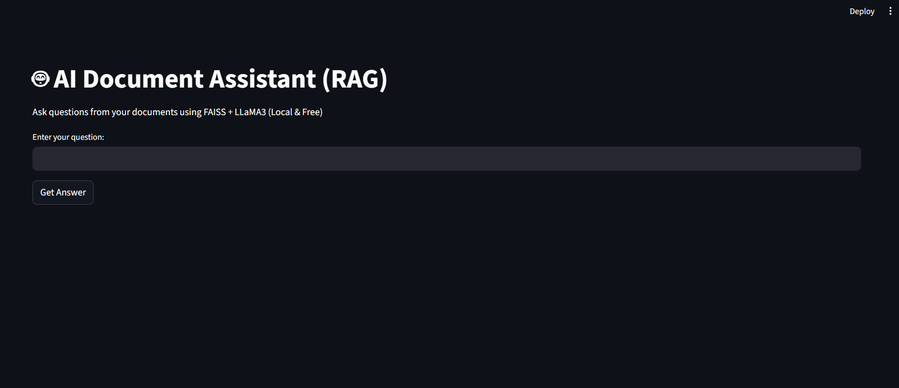
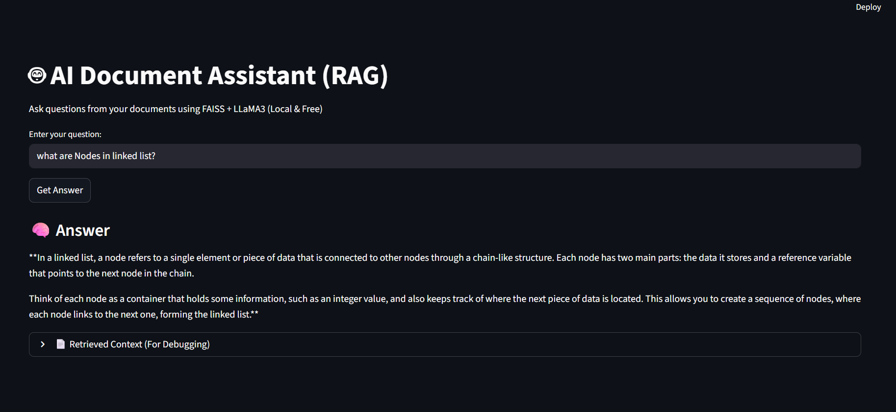

# AI Document Assistant using Retrieval-Augmented Generation (RAG)

## 📌 Project Overview

The **AI Document Assistant** is an end-to-end Retrieval-Augmented Generation (RAG) application that converts video content into searchable knowledge and enables users to ask natural language questions to get accurate, context-aware answers.

This project demonstrates practical implementation of:

- Semantic Search
- Vector Databases
- Local LLM Inference
- End-to-End RAG Architecture

⚡ This version uses **LLaMA3 via Ollama** for fully offline, free LLM inference (no API key required).

This project is ATS-friendly and suitable for showcasing skills in:

- Data Science  
- Machine Learning  
- NLP  
- LLM-based Application Development  

---

## 🎯 Problem Statement

Large video and document content is difficult to search and query efficiently.  
Traditional keyword search fails to capture semantic meaning.

### ✅ Solution

Build a system that:

- Converts videos into text
- Stores semantic embeddings
- Retrieves relevant context using vector search
- Generates precise answers using an LLM (RAG architecture)

---

## 🚀 Key Features

- 🎥 Video to audio conversion  
- 🎙 Automatic speech-to-text transcription using OpenAI Whisper  
- ✂ Text chunking and semantic embeddings  
- ⚡ Fast similarity search using FAISS  
- 🤖 Context-aware answer generation using LLaMA3 (via Ollama)  
- 🧩 Modular and scalable pipeline  
- 💻 Fully offline LLM inference (No API cost)  

---

## 🧠 Architecture (RAG Pipeline)

### 1️⃣ Ingestion  
Video → Audio → Transcript  

### 2️⃣ Embedding Store  
Transcript chunking → Vector embeddings → FAISS index  

### 3️⃣ Retriever  
Semantic search → Top-k relevant chunks  

### 4️⃣ Generator  
LLaMA3 (Ollama) generates answers using retrieved context  

---

## 🛠️ Technologies Used

- Python  
- OpenAI Whisper (Speech-to-Text)  
- Sentence Transformers (`all-MiniLM-L6-v2`)  
- FAISS (Vector Database)  
- Ollama  
- LLaMA3 (Local LLM)  
- MoviePy (Video processing)  
- NumPy  
- Streamlit (Web UI)  

---

## 📂 Project Structure
AI-Document-Assistant-using-RAG/
│
├── videos/

├── audio/

├── transcripts/

├── embeddings/

│ ├── faiss.index

│ └── chunks.npy

│
├── ingest.py

├── embed_store.py

├── retriever.py

├── rag_pipeline.py

├── app.py

├── requirements.txt

├── setup.py

└── README.md


---

# ⚙️ Installation & Setup

## 1️⃣ Clone Repository

```bash
git clone https://github.com/your-username/AI-Document-Assistant-using-RAG.git
cd AI-Document-Assistant-using-RAG

```
## 2️⃣ Create Virtual Environment

```bash
python -m venv venv
```
Activate:

Windows
```bash
venv\Scripts\activate
```

Mac/Linux
```bash
source venv/bin/activate

```
## 3️⃣ Install Dependencies
``` bash
pip install -r requirements.txt
```

# 🤖 Install Ollama (Required for LLM)
1. Download Ollama from: https://ollama.com

2. Install and restart your system.

3. Pull LLaMA3 model:

 ```bash
   ollama pull llama3
```
4. Verify installation:
   
```bash
ollama list
```

---

# ▶️ How to Run (Phase-wise Execution)

## 🔹 Step 0: Initial Setup
``` bash
python setup.py
```
Validates environment and folders.


## 🔹 Phase 1: Video to Text (Ingestion)

``` bash
python ingest.py
```
-Converts video to audio
-Transcribes audio using Whisper
-Saves transcript


## 🔹 Phase 2: Embedding & Vector Store Creation
``` bash
python embed_store.py
```

-Splits transcript into chunks
-Generates embeddings
-Stores vectors in FAISS


## 🔹 Phase 3: Semantic Retrieval (Testing)
``` bash
python retriever.py
```
Tests similarity search.


🔹 Phase 4: RAG Pipeline (LLM Answering)
```bash
python rag_pipeline.py
```
-Retrieves top-k context
-Sends context to LLaMA3 via Ollama
-Generates AI answer


🔹 Phase 5: Streamlit Web App
``` bash
streamlit run app.py
```
Interactive UI to ask questions from documents.

---

## 📈 Results & Impact

   -Enables semantic search over unstructured video content.
   -Improves answer accuracy using context-awre retrieval.
   -Fully offline LLM execution (cost-efficient).
   -Demonstrates real-world RAG system architecture.

---

## 📌 Use Cases

   -Educational video Q&A
   -Corporate training material search
   -Meeting & lecture summarization
   -Knowledge base assistant

---

## 🔮 Future Enhancements

  -PDF & document support
  -Metadata filtering
  -Performance optimization
  -Docker deployment
  -Cloud deployment (optional)

---
# 📎 Screenshots

## 🖥️ Streamlit User Interface



## 🤖 AI Generated Answer



---

# 👩‍💻 Author

Shruti Adsul
Aspiring Data Analyst | ML & LLM Enthusiast

---

# ⭐ Support

If you found this project helpful:

---

# ⭐ Star the repository
🍴 Fork it
💬 Share feedback
---

If you want, I can now:

- 🔥 Optimize this for **top MNC-level portfolio**
- 💼 Convert this into **resume-ready project description**
- 🚀 Write a powerful LinkedIn post for this updated Ollama version**

Just tell me what you want next.


